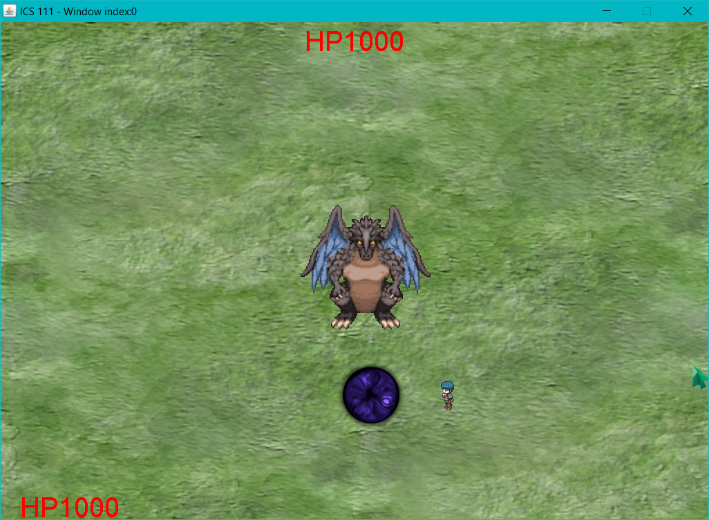
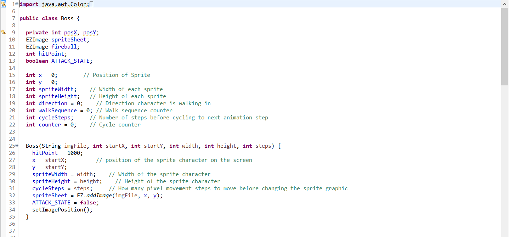
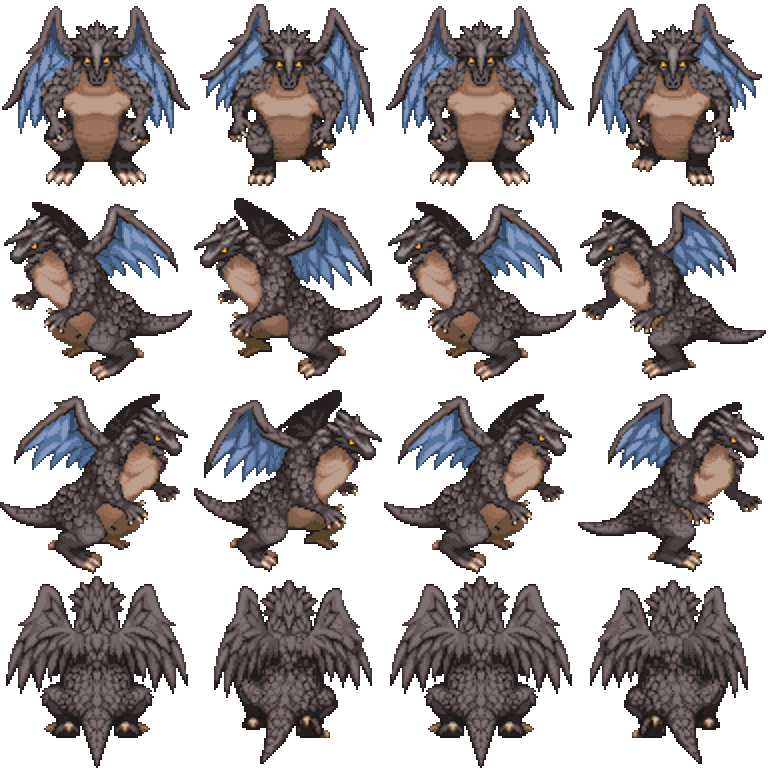
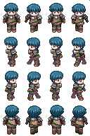

  

  

To conclude my ICS 111 course, my professor assigned the class a final group project wherein we had to create any kind of game using the EZ Graphics library. This was my first experience collaborating on a programming project with other classmates and presenting the finished game in front of the whole class. Regarding what kind of game we should make, my group members and I eventually agreed upon creating a fantasy RPG-like 2D game. The main objective of the game was simple: kill the boss before the boss kills you. In order to do so, the player had to first select their character class. The character classes that we included were the warrior class, which had lots of health but short-ranged damage, or the mage class, which used long-range attacks but had little health. 

  
  

What was probably the most challenging part of this project was implementing the different character classes, as we had to treat both character classes as objects and have them inherit some of the traits of our player class(parent object). The parent object was responsible for giving our warrior and mage basic movement and hitboxes, but the special attacks that our character classes had needed to be implemented separately. Another additional challenge my group faced when making this game was figuring out how to animate sprites using some spritesheets we pulled from free asset websites. When we first tried animating the sprites, sometimes the sprite would fade in and out between cycles, or the sprite would just not appear on screen at all. Lastly, what was probably the most challenging, but most rewarding task we tackled was trying to implement the boss' attack patterns. I was impressed by one of my group members when he figured out how to have the boss not only attack in multiple directions, but also have the boss follow the player depending on the player's current position. In essence, my group member managed to create simple enemy AI that made our simple game feel more dynamic and interactive. 
